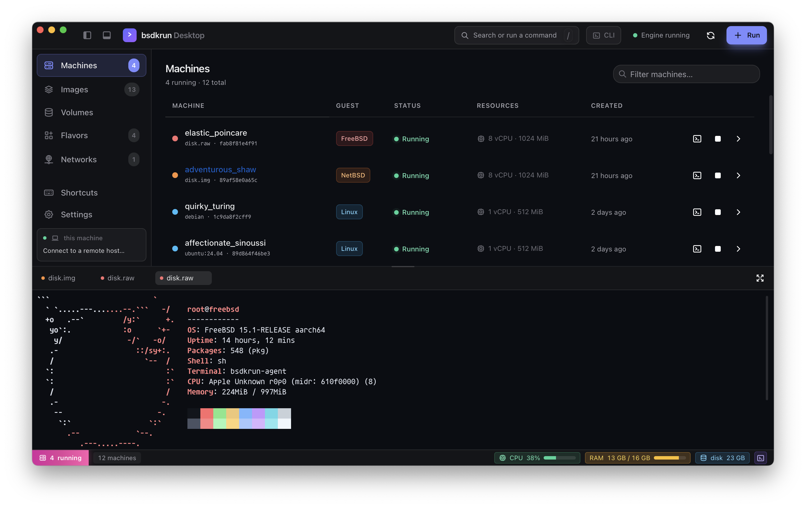

<p align="center">
  
</p>

# bsdkrun

[](https://github.com/tsirysndr/bsdkrun/actions/workflows/nix.yml)
[](https://github.com/tsirysndr/bsdkrun/actions/workflows/e2e-linux.yml)
[](https://flakehub.com/flake/tsirysndr/bsdkrun)
[](https://skills.sh/tsirysndr/bsdkrun/bsdkrun-cli)


A Firecracker-style **microVM launcher for BSD and Linux guests on macOS and Linux**, built on
[libkrun](https://github.com/containers/libkrun) (which drives Apple's Hypervisor.framework on
macOS and KVM on Linux).

`bsdkrun` is a thin, purpose-built CLI: it wraps libkrun's C ABI in a handful of safe Rust
bindings and boots a guest three ways — from a **UEFI firmware** image (the guest's own EFI loader
boots a normal disk), from a **direct kernel + FDT** (no bootloader), or straight from an **OCI
image** (`bsdkrun linux alpine` pulls it from any registry, extracts the rootfs, and boots it like
`docker run`). It is deliberately small: one FFI module, one CLI, no daemon.

> **Platforms:** **macOS on Apple Silicon** (Hypervisor.framework) and **Linux on amd64 or arm64**
> (KVM). A hardware-virtualized guest runs the host's CPU arch, so bsdkrun detects the arch and
> pulls the matching kernel, OCI image, and agent automatically. macOS is arm64-only; Linux works
> on both x86_64 and aarch64. **FreeBSD** boots via EFI on macOS and via **PVH direct kernel** on
> Linux/amd64; **NetBSD** direct-boots its kernel everywhere. The amd64 PVH boots need our
> [PVH-enabled libkrun fork](https://github.com/tsirysndr/libkrun/tree/feat/pvh-boot). _(Linux
> support is new — see the [KVM e2e CI](.github/workflows/e2e-linux.yml).)_

<p align="center">
  
</p>

---

## Contents

- [Why this exists](#why-this-exists)
- [Install](#install)
- [Prerequisites](#prerequisites)
- [Build](#build)
- [Usage](#usage)
  - [`probe`](#probe--sanity-check-the-toolchain)
  - [`freebsd` / `netbsd`](#freebsd--netbsd--one-liner-bsd-microvms)
  - [`firmware`](#firmware--boot-a-disk-through-its-uefi-loader)
  - [`kernel`](#kernel--boot-a-kernel-directly-no-bootloader)
  - [`linux`](#linux--run-an-oci-image-as-a-microvm)
- [Managing machines](#managing-machines)
- [Flavors — preconfigured environments & snapshots](#flavors--preconfigured-environments--snapshots)
- [Networking](#networking)
- [Disks](#disks)
- [Console](#console-how-output-reaches-your-terminal)
- [Preparing a guest image](#preparing-a-guest-image)
- [Project layout](#project-layout)
- [Troubleshooting](#troubleshooting)
- [Status](#status)
- [License](#license)

---

## Why this exists

The usual microVM stacks (Firecracker, Cloud Hypervisor) don't run on macOS, and the usual macOS
VM tooling (QEMU, `vftool`, UTM) isn't microVM-shaped. libkrun gives you a Firecracker-like
"configure a context, then `start_enter`" model on top of Hypervisor.framework — its batteries are
aimed at Linux guests, and `bsdkrun` both leans into that (running OCI images directly) and points
the same machinery at **FreeBSD / NetBSD** guests.

- **FreeBSD:** on **macOS**, boot via **firmware/EFI** — we hand libkrun its bundled EDK2 firmware
  and let the guest's `loader.efi` take over from the EFI System Partition on the disk (that
  firmware ships only with the macOS `libkrun-efi`). On **Linux/amd64**, boot via **PVH direct
  kernel**: bsdkrun downloads its bundled agent-injected UFS rootfs + FreeBSD's **`FIRECRACKER`**
  kernel (no ACPI, MPTable, virtio-mmio built in) and enters it at its `PHYS32_ENTRY` — which
  needs our [PVH-enabled libkrun fork](https://github.com/tsirysndr/libkrun/tree/feat/pvh-boot)
  (see the [FreeBSD notes](#freebsd--netbsd--one-liner-bsd-microvms)).
- **NetBSD:** boot via **direct kernel** — **no bootloader or firmware**, so `bsdkrun netbsd` works
  on **both macOS and Linux**. On **arm64** it uses NetBSD's evbarm `GENERIC64` kernel + bsdkrun's
  agent-injected `gzimg`. NetBSD ships no amd64 disk image, so on **amd64** bsdkrun uses its own
  bundled FFS rootfs plus the **`MICROVM`** kernel, entered via **PVH** — which needs our
  [PVH-enabled libkrun fork](https://github.com/tsirysndr/libkrun/tree/feat/pvh-boot) (see the
  [NetBSD notes](#netbsd-version-handling-is-arch-specific)).
- **Linux:** run any **OCI image** as a microVM — bsdkrun fetches a prebuilt kernel, pulls the
  image from any registry, extracts its rootfs, and boots it `docker run`-style, with internet
  access out of the box. See [`linux`](#linux--run-an-oci-image-as-a-microvm).

> DragonFly BSD is out of scope: there's no arm64 port.

The open research question is guest-side **virtio-mmio device discovery**. libkrun exposes its
virtio devices over MMIO (there is no PCI bus), and describes them via the ACPI/FDT it hands the
guest. Whether a given BSD kernel enumerates those virtio-mmio devices — and routes its console to
libkrun's virtio-console — is exactly what this tool is for probing.

---

## Install

**macOS (Apple Silicon)** — a prebuilt, already-signed binary via Homebrew:

```sh
brew install tsirysndr/tap/bsdkrun
```

This auto-taps `libkrun/krun` and pulls in its dependencies (`libkrun`, `gvproxy`). The binary
ships codesigned with the hypervisor entitlement, so there's nothing else to set up — jump to
[Usage](#usage).

**npm** — install the prebuilt host binary for your platform (macOS/arm64, Linux/x64, Linux/arm64):

```sh
npm install -g @bsdkrun/cli   # or: npx @bsdkrun/cli linux alpine -- echo hi
```

A postinstall step downloads the matching `bsdkrun` from the GitHub release and verifies its
SHA-256. On **Linux** the archive **bundles libkrun** (`libkrun.so`/`libkrunfw.so`, rpath'd to
`$ORIGIN`), so it works with no separate libkrun install — only `gvproxy` is needed for guest
networking. On **macOS** it's just the binary and links Homebrew's libkrun (`brew install libkrun`).
Unsupported platforms (Windows, Intel macOS, 32-bit) fail the install with a clear message. See
[`npm/`](npm/) for details.

**Nix flake** — builds bsdkrun with all its dependencies. On **Linux (amd64/arm64)** it links
nixpkgs' libkrun; on **macOS** it links your Homebrew libkrun, so those need `--impure`
(`brew install libkrun/krun/libkrun` first) and produce a binary re-signed with the hypervisor
entitlement.

```sh
# Linux — needs /dev/kvm access: sudo usermod -aG kvm $USER && newgrp kvm
nix run           github:tsirysndr/bsdkrun -- linux alpine   # run without installing
nix profile install github:tsirysndr/bsdkrun                 # install into your profile
nix develop       github:tsirysndr/bsdkrun                   # dev shell with the full toolchain

# macOS (Apple Silicon) — impure link against Homebrew's libkrun
brew install libkrun/krun/libkrun
nix build  --impure github:tsirysndr/bsdkrun                  # -> ./result/bin/bsdkrun
nix run    --impure github:tsirysndr/bsdkrun -- linux alpine
```

The flake wraps the runtime tools (`curl`, `tar`, `gzip`, `xz`, `cpio`, `gvproxy`, …) onto `PATH`,
and `nix develop` adds the Rust toolchain plus `zig`/`cargo-zigbuild` for cross-building the guest
agents. To hack on bsdkrun without Nix, build from source — see [Prerequisites](#prerequisites) and
[Build](#build).

---

## Prerequisites

You need **libkrun**, a **Rust toolchain** (`rustup default stable`; edition 2021), and access to
the hypervisor. The hypervisor part differs by OS.

### macOS (Apple Silicon)

libkrun, `krunvm`, and `krunkit` live in the **`libkrun/krun`** tap (redirected from the old
`slp/krun`). Homebrew 6.x requires you to trust a third-party tap before it will run its install
code:

```sh
brew tap libkrun/krun
brew trust libkrun/krun     # required on Homebrew 6.x for third-party taps
brew install libkrun krunkit
```

- **`libkrun`** provides `libkrun.dylib` (the C ABI we link against).
- **`krunkit`** ships the EDK2 UEFI firmware we use for EFI boot
  (`.../share/krunkit/KRUN_EFI.silent.fd`).

**The Hypervisor entitlement (the part that bites everyone).** A binary that calls libkrun must be
codesigned with `com.apple.security.hypervisor` (plus `com.apple.security.cs.disable-library-validation`
so it can load the Homebrew dylibs). Without it, `krun_create_ctx`/`krun_set_vm_config` succeed but
`krun_start_enter` fails at VM creation with `Internal(Vm(VmSetup(VmCreate)))` / **errno 22
(EINVAL)**. Worse, **every `cargo build` strips the codesignature**, so you must re-sign after each
build — the [`Makefile`](./Makefile) does this for you (entitlements in
[`bsdkrun.entitlements`](./bsdkrun.entitlements)).

### Linux (amd64 or arm64, KVM)

libkrun uses **KVM** on Linux — no codesigning, but you need **`/dev/kvm`** access. Add yourself to
the `kvm` group (or run under `sudo`):

```sh
sudo usermod -aG kvm $USER && newgrp kvm
```

Ubuntu has no libkrun package, so build it (and its bundled kernel, libkrunfw) from source — see the
[KVM e2e workflow](.github/workflows/e2e-linux.yml) for the exact steps:

```sh
git clone --depth 1 https://github.com/containers/libkrunfw && make -C libkrunfw && sudo make -C libkrunfw install
git clone --depth 1 https://github.com/containers/libkrun   && make -C libkrun   && sudo make -C libkrun   install
sudo ldconfig
```

`build.rs` finds libkrun via `pkg-config libkrun` (or the standard lib dirs; override with
`LIBKRUN_PREFIX=/path`). There's nothing to sign — `make build` skips the codesign step on Linux.
Some BSD image-prep steps (`losetup`/`mount`) need root, and bsdkrun runs them with `sudo`
automatically when needed.

> On Linux the CI boots the `linux` (OCI), `netbsd`, and `freebsd` (both direct-kernel, PVH) paths
> — on x86_64 only, since GitHub's arm64 runners have no `/dev/kvm`; arm64-on-Linux (which reuses
> the aarch64 kernel + agent) is validated on a KVM-capable host. The BSD-under-KVM amd64 boots go
> via our [PVH libkrun fork](https://github.com/tsirysndr/libkrun/tree/feat/pvh-boot), which the
> CI builds.

---

## Build

```sh
make build      # cargo build (debug)  [+ codesign on macOS]
make release    # cargo build --release [+ codesign on macOS]
```

`make run ARGS="..."` builds and runs in one step.

> ⚠️ **macOS: don't run `cargo build` then the binary directly** — it'll be unsigned and fail at
> boot with errno 22. Go through `make`, or re-run `make sign` after a bare `cargo build`. On Linux
> there's nothing to sign, so `cargo build` is fine (the `make` sign steps are no-ops there).

The [`build.rs`](./build.rs) locates libkrun via `brew --prefix libkrun` (macOS) or `pkg-config`
(Linux), override with `LIBKRUN_PREFIX=/path`, and embeds an rpath so the shared library resolves
at runtime.

---

## Usage

```
bsdkrun [--log-level N] <command>

Global:
  --log-level N   log verbosity, 0=off .. 5=trace (default 1)
```

`--log-level` drives two things at once: libkrun's internal logging *and* bsdkrun's own logging
(via the [`tracing`](https://docs.rs/tracing) crate). Both go to **stderr**, so they never mix with
the guest console on stdout. `0`→warn, `1..3`→info, `4`→debug, `5`→trace. Set the `RUST_LOG`
environment variable to override bsdkrun's filter with anything
[`EnvFilter`](https://docs.rs/tracing-subscriber/latest/tracing_subscriber/filter/struct.EnvFilter.html)
accepts (e.g. `RUST_LOG=bsdkrun=debug`). For a clean guest console, use `--log-level 0` or `1`.

### `probe` — sanity check the toolchain

Verifies that libkrun links and that a context can be created and configured. Does **not** boot
(so it won't exercise the hypervisor entitlement — see the note above).

```sh
make run ARGS="probe"
```

### `freebsd` / `netbsd` — one-liner BSD microVMs

The quickest way to a BSD guest — fetches the image (and, for NetBSD, the kernel) if needed, then
boots it:

```sh
bsdkrun freebsd                 # bundled FreeBSD image (agent baked in): EFI on macOS, PVH on Linux/amd64
bsdkrun freebsd --version 14.3  # official FreeBSD 14.3 VM image from download.freebsd.org
bsdkrun netbsd  -d              # NetBSD-current in the background; prints its id
bsdkrun netbsd  --version 10.1 -d --port 2222:22
```

Like `bsdkrun linux`, you can pass a **command to run inside the guest** after `--`. The guest
boots, its agent runs the command (streaming stdout/stderr), and — without `-d` — the VM powers
off afterward, with bsdkrun exiting on the command's status (a one-shot, à la `docker run`). With
`-d` the machine is left running once the command returns. Needs networking (the agent), so it's
incompatible with `--no-net`:

```sh
bsdkrun freebsd -- uname -a           # boot, run, print, power off; exit = command's status
bsdkrun netbsd  -- sh -c 'sysctl hw.model'
bsdkrun freebsd -d -- pkg install -y curl   # run a setup step, then leave the VM up
```

With **no command** (and no `-d`), a foreground `bsdkrun freebsd` / `bsdkrun netbsd` drops you
straight into an **interactive shell** over the agent — the bundled images are headless (no console
login), so this is the way in — and powers the VM off when you exit, like foreground `bsdkrun
linux`. A short `⋯ waiting for the guest agent` line shows while the guest boots (~15-20s).

```sh
bsdkrun freebsd        # boot, then an interactive /bin/sh; exit (Ctrl-D) powers it off
bsdkrun netbsd -d      # no shell — just background it and print the id (use exec/ssh/shell)
```

Add **`--verbose`** to stream the guest's **boot console to stdout** while it comes up (instead of
the terse spinner) — handy for watching a boot or asserting on it in CI. The command output / shell
follows once the agent is up:

```sh
bsdkrun freebsd --verbose -- uname -a   # full boot log, then the command output, on stdout
```

Both carry the usual machine options (`-d`, `--persist`, `-v/--volume`, `--version`,
`--attach-disk`, `--port`, `--cpus`/`--mem`), so per-machine [CoW disk clones](#managing-machines)
and `ps`/`logs`/`shell`/`stop` all apply. They differ in how they boot:

- **`freebsd`** boots differently per host OS:
  - On **macOS** it wraps [`fetch`](#the-easy-way--bsdkrun-fetch) + [`firmware`](#firmware--boot-a-disk-through-its-uefi-loader):
    it auto-locates libkrun's `KRUN_EFI` firmware (via `$BSDKRUN_FIRMWARE`, a local
    `images/KRUN_EFI.fd`, or krunkit's Homebrew install; `--firmware` overrides). By default (on
    arm64) it downloads bsdkrun's **bundled image with the guest agent pre-installed**, so
    `exec`/`shell` work out of the box; pass **`--version X`** to boot an official FreeBSD VM image
    from download.freebsd.org instead (no agent — you'd install it manually).
  - On **Linux/amd64** it **PVH-direct-boots** bsdkrun's bundled agent-injected UFS rootfs + the
    FreeBSD **`FIRECRACKER`** kernel (no ACPI, MPTable enumeration, virtio-mmio + serial built in;
    built from source by the
    [image workflow](.github/workflows/release-freebsd-amd64-image.yml)). Needs the
    [PVH libkrun fork](https://github.com/tsirysndr/libkrun/tree/feat/pvh-boot); override the
    kernel command line with `$BSDKRUN_FREEBSD_CMDLINE`.
- **`netbsd`** wraps `fetch` + a **direct kernel** boot — no firmware — so it works on **macOS and
  Linux**.

### `firmware` — boot a disk through its UEFI loader

The explicit form (the `freebsd`/`netbsd` shortcuts wrap it). Point it at libkrun's EDK2 firmware
and a raw disk image that carries an EFI System Partition:

```sh
make release
./target/release/bsdkrun firmware \
  --firmware "$(brew --prefix)/share/krunkit/KRUN_EFI.silent.fd" \
  --disk images/fbsd15.raw \
  --cpus 2 --mem 2048
```

- Use libkrun's **own** `KRUN_EFI.silent.fd` firmware — **not** a generic QEMU `AAVMF`/`edk2`
  build. libkrun uses its own guest memory layout, and only its firmware matches it. The
  `.silent` variant just suppresses EDK2's own console chatter; the guest OS console still comes
  through the serial console (see [Console](#console-how-output-reaches-your-terminal) below).
- The disk is attached read-write as a virtio-blk device (`block_id = "root"`).

This path is confirmed booting **FreeBSD 15 / arm64** all the way to a `login:` prompt. Two
things make it work: bsdkrun wires the guest's serial console to your terminal (see below), and
the FreeBSD image needs a one-line console hint on its ESP (see
[Preparing a FreeBSD arm64 image](#preparing-a-freebsd-arm64-image)).

### `kernel` — boot a kernel directly (no bootloader)

The path for **NetBSD/evbarm** and bare kernel experiments. libkrun generates the FDT and jumps
into the kernel:

```sh
./target/release/bsdkrun kernel \
  --kernel path/to/netbsd \
  --format elf \
  --cmdline "console=..." \
  --disk images/root.raw \
  --cpus 1 --mem 512
```

`--format` is one of `elf` (default) or `raw`. `--initramfs` is optional.

### `linux` — run an OCI image as a microVM

Run any Docker Hub / OCI image as a Linux microVM, `docker run`-style. bsdkrun fetches a prebuilt
aarch64 kernel (cached), pulls the image for `linux/arm64`, extracts its rootfs, and boots it:

```sh
# run alpine's default shell
./target/release/bsdkrun linux alpine

# run a specific command, with more RAM
./target/release/bsdkrun linux alpine --mem 1024 -- /bin/sh -c 'uname -a; cat /etc/os-release'

# any registry / tag
./target/release/bsdkrun linux ghcr.io/owner/name:tag
```

How it works:

- **Kernel** — a prebuilt aarch64 `vmlinux` is downloaded from
  [vmlinux-builder](https://github.com/tsirysndr/vmlinux-builder) and cached. libkrun's aarch64
  loader needs the raw `Image` format, so bsdkrun flattens the ELF to an `Image` (in pure Rust — no
  binutils) and caches that too. Pick a release with `--kernel-version` (default `7.1.5`), or point
  at your own kernel with `--kernel /path` (ELF or raw `Image`).
- **Rootfs** — the OCI image is pulled straight from the registry (no Docker daemon; just `curl` +
  `tar`) and its layers are extracted, applying whiteouts. The result is **cached, content-addressed
  by image digest**, so a repeat run is instant. By default the rootfs is packed into an
  **initramfs** and booted from RAM, with a generated `/init` that mounts `/proc` + `/sys`,
  configures networking, and runs the image's Entrypoint/Cmd (honoring `Env`/`WorkingDir`).
- **Entrypoint** — Docker semantics: args after `--` replace the image `Cmd`; `--entrypoint`
  replaces the Entrypoint. When the workload exits, the VM powers off cleanly.
- **Networking** — on by default (see [Networking](#networking)); the guest gets internet access
  (ICMP/DNS/TCP) via gvproxy, configured through the kernel command line so the image itself needs
  no `ip`/`dhcp` tools. `--no-net` disables it.

Notes:

- **Rootfs** — by default the rootfs is served from disk over **virtio-fs** (no RAM-size limit, so
  it's fine for large images). bsdkrun clones the cached rootfs per machine with an APFS
  copy-on-write clone (`cp -Rc` — instant, no extra disk until the guest writes), so machines stay
  isolated and the shared image cache stays pristine. It boots our own init from the shared root
  (not libkrun's `init.krun`, which only works with the bundled libkrunfw kernel). Needs a guest
  kernel with `CONFIG_VIRTIO_FS=y` (note: `CONFIG_FUSE_FS` alone is **not** enough — the default
  prebuilt kernel has it).
- **`--initramfs`** boots from an initramfs instead (the whole rootfs is loaded into RAM). Use it
  for a kernel without virtio-fs. Then size `--mem` above the image size — bsdkrun warns if it looks
  too small.
- Either way the image must have a `/bin/sh` (scratch/distroless images won't boot this way), and
  the console defaults to `hvc0` (libkrun's virtio-console; `--console` overrides it).

### systemd — turn an OCI guest into a full systemd system

OCI images boot with bsdkrun's tiny generated `/init` as PID 1 — great for `docker run`-style
workloads, but no services, journal, or timers. One command flips a **debian/ubuntu/fedora**
guest to real systemd:

```sh
id=$(bsdkrun linux -d -v dev debian -- sleep infinity)
bsdkrun systemd $id setup      # installs systemd if missing + the agent unit, marks the rootfs
bsdkrun stop $id
id=$(bsdkrun linux -d -v dev debian)   # same volume -> boots systemd as PID 1
bsdkrun systemd $id status     # "PID 1: systemd"
```

`setup` installs systemd where missing (`apt-get`/`dnf` — Alpine has no systemd and fails with a
clear message), writes + enables a `bsdkrun-agent.service` unit (so `exec`/`shell` keep working
under systemd), and drops a marker (`/etc/bsdkrun-systemd`) that makes the generated init **exec
systemd as PID 1** on the next boot. `disable` removes the marker. In systemd mode the image
entrypoint/`--` command is not run — systemd owns userspace; manage workloads as units. Boot on a
**volume** (`-v`) so the installed packages + marker survive across machines.

---

## Managing machines

bsdkrun keeps a small SQLite database (`sqlx`) under `$XDG_STATE_HOME/bsdkrun` recording the
machines you run, the images you've pulled, and disks you've attached — each with a **Docker-style
short id**. The same Docker-like commands work for **every guest type** — Linux (`linux`) and BSD
(`firmware` / `kernel`) alike — bsdkrun records each machine's kind and applies the right logic:

```sh
# run any machine in the background; prints its id
id=$(bsdkrun linux -d alpine)
id=$(bsdkrun firmware -d --firmware images/KRUN_EFI.fd --disk images/fbsd15.raw)

bsdkrun ps                 # list running machines (-a for all, incl. exited)
bsdkrun images             # list images: pulled OCI images + fetched BSD images
bsdkrun logs $id           # print the machine's console log
bsdkrun logs -f $id        # follow it live
bsdkrun exec $id uname -a  # run a command inside the guest (-t for a PTY, -e K=V for env)
bsdkrun shell $id          # open an interactive shell in the guest
bsdkrun stop $id           # stop a running machine (BSD guests clean-poweroff first)
bsdkrun start $id          # re-boot a stopped machine in place — resumes its own disk/rootfs
bsdkrun update $id --cpus 4 --mem 2048   # change recorded vCPU / RAM (applies on next start)
bsdkrun rm $id             # remove a machine and its state (-f stops it first)
```

Any unique **id prefix** works (`bsdkrun stop 8e1c`). `shell` attaches to the guest console: for a
Linux machine that's an interactive shell (with `exit`/re-attach); for BSD it's the guest's own
console (e.g. the `login:` prompt).

**`stop`/`start` persist your data.** A `start` resumes the machine's **own** disk/rootfs — the
committed snapshot it was booted from *plus* any runtime changes — not a fresh copy of the base
image, so stopping and starting keeps your data (like `docker start`). For BSD guests, `stop`
cleanly powers the guest off (`shutdown -p now`) so its UFS is unmounted and consistent before the
next boot — this takes a few seconds; without it a killed live UFS would be torn and `fsck` would
discard recent writes. (A brand-new `run` without `-v`/`--persist` is still ephemeral — see below.)

**Clone a repo on boot (`--repo`)** — pass a git URL to any run and bsdkrun clones it into the
guest after boot (installing `git` first if the base lacks it — apt/apk/dnf/pacman/pkg/pkgin/…) and
drops you into it when you open a shell:

```sh
bsdkrun linux  -d --repo https://github.com/owner/app node:22   # clone into ~/app, cd on shell
bsdkrun freebsd -d --repo https://github.com/owner/app
```

**Copy-on-write disks** — a BSD machine's root disk is cloned per machine with an APFS `clonefile`
(`cp -c` — instant, and costs no extra disk until the guest writes), so you can boot **many
microVMs from one base image** concurrently without touching it. Pass `--persist` to boot the disk
in place instead (writes persist; one machine at a time). Linux machines get the same isolation via
their per-machine virtio-fs clone.

**Persistent volumes (`-v NAME`)** — by default every boot starts from a fresh clone, so guest
changes are thrown away when the machine exits. To keep them across reboots, name a volume — works
the same for Linux, FreeBSD and NetBSD:

```sh
bsdkrun linux   -d -v web alpine            # persistent Linux rootfs
bsdkrun freebsd -d -v db                    # persistent FreeBSD disk
```

Reuse the same `-v NAME` and the machine comes back up with your changes intact. It's a single
writer at a time (run one machine per volume), and it's mutually exclusive with `--persist` (which
writes to the base image itself). The mechanism is the same idea for every guest — a copy-on-write
clone that persists:

- **Linux** serves the volume as a **writable virtio-fs root**. First use copy-on-write clones the
  OCI image into the volume dir (`clonefile` on APFS / `reflink` on btrfs/xfs — instant, and only
  grows as the guest writes; a plain copy elsewhere); later boots reuse it, so your changes persist.
  Needs the default virtio-fs (not `--initramfs`, a RAM disk with nothing to persist). (Earlier
  builds layered overlayfs over virtio-fs, but the Linux/KVM kernel rejects a virtio-fs overlay
  upperdir, so a plain writable clone is used instead — it works identically on macOS and Linux.)
- **FreeBSD / NetBSD** use an **APFS copy-on-write clone** of the disk image under
  `<state>/volumes/<NAME>` (instant, and only grows as the guest writes).

Volumes are recorded in the state DB and managed Docker-style:

```sh
bsdkrun volume ls              # NAME, GUEST, BASE, SIZE (du, CoW-aware), CREATED
bsdkrun volume rm web          # delete a volume's data (refused if a machine is using it)
bsdkrun volume rm -f web db    # force removal / multiple names
```

**Bind-mount host directories (`--mount`, Linux only)** — share a host directory into the guest at
a path, like `docker run -v`. Repeatable; append `:ro` for read-only:

```sh
bsdkrun linux --mount ~/project:/src --mount ~/data:/data:ro alpine -- ls /src
```

Each `--mount HOST:GUEST[:ro]` becomes a virtio-fs share the generated init mounts at `GUEST`
(the host dir must exist; `GUEST` must be absolute). Reads and writes pass straight through to the
host, and it composes with `-v` (persistent volume) and every Linux root mode.

How it works — no daemon:

- **`-d` detached** — bsdkrun forks; the child `setsid`s, wires the guest console (`hvc0`) to a
  per-machine **PTY**, and a broker thread fans that PTY out to `console.log` and a Unix socket
  (`console.sock`) under `…/machines/<id>/`. The parent records the machine (with the child's pid)
  and prints the id. (libkrun's implicit console only writes to a **tty** — a plain pipe/socket
  would just get *logged* — which is why the console is a PTY.)
- **`logs`** reads `console.log`; **`-f`** then streams `console.sock`.
- **`exec` / `shell`** run a **new** process in the guest through an in-guest agent (see below) —
  `docker exec`, not `docker attach`. `exec` forwards stdin/stdout/stderr and the exit code (`-t`
  allocates a PTY, `-e K=V` sets env); `shell` is `exec -t /bin/sh`. When a machine has no agent,
  `shell` falls back to attaching the guest **console** over `console.sock` (raw-mode proxy, the
  recent console replayed on attach, **Ctrl-]** to detach).
- **Persistence** — a detached machine with **no explicit command** (`bsdkrun linux -d alpine`)
  keeps a console shell alive: typing `exit` (or Ctrl-]) returns you to your **host** prompt and
  leaves the machine **running** — re-attach any time with `shell` for a fresh shell; the machine
  ends only when you `stop` it. Give it a command (`… -d alpine -- myserver`) and it behaves like
  Docker instead — the machine powers off when that command exits.
- **`stop`** sends `SIGTERM` to the machine's process (whose signal handler tears down gvproxy).
- **`ps`** reconciles: a machine still marked *running* whose process is gone is shown as *exited*.

### The exec agent

`exec`/`shell` talk to a tiny in-guest **agent** that listens on **TCP port 1024** and runs one
command per connection over a small framed protocol (stdin/stdout/stderr + exit code, optional
PTY). There's no vsock dependency: bsdkrun forwards a per-machine host port to the guest through
gvproxy, so the same mechanism works for Linux and BSD. The agent needs the guest's network up
(gvproxy leases it `192.168.127.2`), so `exec`/`shell` require networking (not `--no-net`).

- **Linux** — bsdkrun downloads the aarch64 agent from the GitHub release (cached under
  `~/.cache/bsdkrun/agent/`), injects it into the rootfs, and starts it on boot. Nothing to do.
  (Point `BSDKRUN_AGENT_LINUX` at a local binary, or `BSDKRUN_AGENT_VERSION` at a different tag,
  to override.)
- **FreeBSD / NetBSD** — bsdkrun can't write the guest's UFS/FFS from macOS, so you install the
  agent yourself, once, inside the running guest.

**BSD setup** (as root — the default no-password user). Download the matching binary from the
release into the guest, which has internet by default:

```sh
# FreeBSD (fetch is built in):
fetch -o /usr/local/sbin/bsdkrun-agent \
  https://github.com/tsirysndr/bsdkrun/releases/download/v0.1.0/bsdkrun-agent.freebsd-aarch64

# NetBSD (ftp speaks https):
ftp -o /usr/local/sbin/bsdkrun-agent \
  https://github.com/tsirysndr/bsdkrun/releases/download/v0.1.0/bsdkrun-agent.netbsd-aarch64

chmod +x /usr/local/sbin/bsdkrun-agent
/usr/local/sbin/bsdkrun-agent &          # start it now; listens on TCP :1024
```

From the host, `bsdkrun exec <id> uname -a` now works. The quickest way to start it on every boot
is a line in `/etc/rc.local`:

```sh
/usr/local/sbin/bsdkrun-agent &
```

**As a proper service** — drop in an `rc.d` script (both are in [`packaging/`](./packaging)):

<details>
<summary>FreeBSD — <code>/usr/local/etc/rc.d/bsdkrun_agent</code></summary>

```sh
#!/bin/sh
#
# PROVIDE: bsdkrun_agent
# REQUIRE: NETWORKING
# KEYWORD: shutdown

. /etc/rc.subr

name="bsdkrun_agent"
rcvar="bsdkrun_agent_enable"

load_rc_config $name

: ${bsdkrun_agent_enable:="NO"}
: ${bsdkrun_agent_program:="/usr/local/sbin/bsdkrun-agent"}

pidfile="/var/run/${name}.pid"
# daemon(8): -f background, -P track pid, -r restart the agent if it exits.
command="/usr/sbin/daemon"
command_args="-f -P ${pidfile} -r ${bsdkrun_agent_program}"

run_rc_command "$1"
```

```sh
chmod +x /usr/local/etc/rc.d/bsdkrun_agent
sysrc bsdkrun_agent_enable=YES
service bsdkrun_agent start
```
</details>

<details>
<summary>NetBSD — <code>/etc/rc.d/bsdkrun_agent</code> (no <code>daemon(8)</code>, so we track the pid ourselves)</summary>

```sh
#!/bin/sh
#
# PROVIDE: bsdkrun_agent
# REQUIRE: NETWORKING

. /etc/rc.subr

name="bsdkrun_agent"
rcvar=$name
command="/usr/local/sbin/bsdkrun-agent"
pidfile="/var/run/${name}.pid"

start_cmd="agent_start"
stop_cmd="agent_stop"

agent_start()
{
	echo "Starting ${name}."
	${command} &
	echo $! > ${pidfile}
}

agent_stop()
{
	if [ -f ${pidfile} ]; then
		kill "$(cat ${pidfile})" 2>/dev/null && rm -f ${pidfile}
	fi
}

load_rc_config $name
run_rc_command "$1"
```

```sh
chmod +x /etc/rc.d/bsdkrun_agent
echo 'bsdkrun_agent=YES' >> /etc/rc.conf
/etc/rc.d/bsdkrun_agent start
```
</details>

If `exec` times out, check inside the guest that networking is up (`ifconfig` shows
`192.168.127.2`) and the agent is listening (`netstat -an | grep 1024`).

> The FreeBSD binary is dynamically linked for FreeBSD 14+; the NetBSD binary is built natively on
> NetBSD 10.

---

## Flavors — preconfigured environments & snapshots

A **flavor** is a named, ready-to-boot environment. Launch one with a single command; the first run
provisions and caches it, and every later launch clones that cache — so it's instant after the first
build, like `docker build` + `docker run`:

```sh
bsdkrun flavors                     # list the catalog + your snapshots + your flavors.toml entries
bsdkrun flavor run -d node          # boot Node.js 22
bsdkrun flavor run -d claude-code   # boot an AI coding agent (Claude Code) — provisioned once
bsdkrun flavor build laravel        # pre-build a flavor's cache (streams the provisioning)
```

Flavors come from three places:

- **Catalog** — curated, built-in environments across several categories:
  - **languages / runtimes:** `node`, `python` (uv), `php` (composer), `laravel`, `symfony`,
    `elixir`, `phoenix`, `gleam` (nix), `clojure`, `nix`, `docker`
  - **AI coding agents:** `claude-code`, `codex`, `opencode`, `crush`, `copilot`
  - **services:** `postgres`, `mysql`, `redis` · **web:** `nginx`, `apache`, `caddy`
  - **operating systems:** `freebsd`, `netbsd`
- **User** — your own stacks, declared in a `flavors.toml` (`$BSDKRUN_FLAVORS_FILE`, else
  `./bsdkrun.flavors.toml`, else `~/.config/bsdkrun/flavors.toml`):

  ```toml
  [[flavor]]
  name = "my-api"
  base = "node:22"          # an OCI ref, or `freebsd` / `netbsd`
  category = "language"
  ports = ["3000:3000"]
  env = ["NODE_ENV=development"]
  provision = ["apt-get update && apt-get install -y git", "npm install -g pnpm"]
  ```

  Manage them from the CLI too: `bsdkrun flavor add my-api --base node:22 --provision "npm i -g pnpm"`
  and `bsdkrun flavor rm my-api`.
- **Snapshots** — freeze a running (or stopped) machine's current state into a reusable flavor, like
  `docker commit`. Boot FreeBSD, install your tools, then capture it:

  ```sh
  id=$(bsdkrun freebsd -d)
  bsdkrun exec $id pkg install -y git tmux vim
  bsdkrun commit $id my-freebsd-dev --description "FreeBSD with my toolchain"
  bsdkrun flavor run -d my-freebsd-dev            # clone that exact state into a fresh machine
  ```

  Snapshots are CoW clones (rootfs for Linux, the raw disk for BSD), so they're cheap to store and
  boot.

**Build methods** are shown per flavor so you know how it's provisioned: **docker** (a plain OCI
image), **nix** (packages via the Determinate Systems installer), or **system** (packages/shell
provisioning in the guest). Provisioning steps compose with `-v` volumes, `--port`, and `--repo`.

---

## Networking

`firmware`, `kernel`, and `linux` all give the guest **internet access by default** — no flags
needed. libkrun's built-in TSI backend only works for Linux guests via an in-guest shim, so we
instead give every guest a real `virtio-net` NIC wired to [**gvproxy**](https://github.com/containers/gvisor-tap-vsock),
a userspace network stack that NATs the guest out to your host's network. The guest DHCPs an
address on `192.168.127.0/24` (gateway `.1`, guest `.2`) with working DNS.

Install gvproxy once:

```sh
brew install gvproxy
```

If gvproxy isn't installed, bsdkrun prints a warning and boots the guest **without** a NIC (unless
you asked for `--port`, which then hard-errors). Disable networking explicitly with `--no-net`.

Each VM gets its **own** gvproxy instance and its own isolated network, so you can run several
guests at once. gvproxy is torn down automatically when the VM exits — including when you interrupt
it (Ctrl-C / `kill`), via a signal handler that also restores your terminal.

### Global networks — reach machines by name

By default each machine is isolated. Opt in to a **shared network** so machines share one subnet
and reach each other **by IP and by name** (docker-compose style), with internal DNS:

```sh
bsdkrun network create devnet                     # one shared gvproxy switch
bsdkrun linux -d --network devnet --name db  postgres
bsdkrun linux -d --network devnet --name api myapi
bsdkrun exec api -- ping db                        # resolves db → 192.168.127.x
```

Members get distinct IPs on `192.168.127.0/24` and a DNS name of their `--name` (defaults to a
generated one). Manage networks and membership:

```sh
bsdkrun network ls                      # networks + running/total members
bsdkrun network connect <machine> devnet   # join/switch an existing machine (applies on next start)
bsdkrun network disconnect <machine>       # back to isolated (applies on next start)
bsdkrun network sync devnet                # refresh members' /etc/hosts (fixes name lookup)
bsdkrun network rm [-f] devnet
```

Membership is editable after creation and re-applied on `start`. Names resolve on Linux and FreeBSD
via the network's DNS; **NetBSD** resolves via a synced `/etc/hosts` block (its resolver rejects the
DNS's AAAA `NXDOMAIN` for A-only names) — joins auto-sync, and `network sync` refreshes an existing
network without restarting members.

### SSH into the guest

gvproxy forwards a **unique** host port to the guest's SSH (`:22`) for each VM. bsdkrun logs it at
boot:

```
INFO networking up — SSH into the guest with: ssh -p 58851 user@127.0.0.1
```

(The guest must be running `sshd` and permit your login, of course.)

### Forwarding extra ports

`--port HOST:GUEST` (repeatable) forwards a host TCP port into the guest:

```sh
./target/release/bsdkrun firmware \
  --firmware "$(brew --prefix)/share/krunkit/KRUN_EFI.silent.fd" \
  --disk images/fbsd15.raw \
  --port 8080:80 --port 2222:22 \
  --cpus 2 --mem 2048
```

`--mac AA:BB:CC:DD:EE:FF` overrides the guest NIC's MAC (default: a fixed locally-administered one).

### SSH — key-based access in one command

The guest agent also manages sshd on **Linux, FreeBSD and NetBSD** guests. The one-liner
installs your local `~/.ssh/id_*.pub` keys, installs sshd where the OS lacks it (Linux OCI
guests — the BSDs ship it in base), generates host keys, and enables + starts the service:

```sh
bsdkrun ssh <id> setup                      # your local public keys, root login
ssh -p <port> root@127.0.0.1                # port from `bsdkrun ps` / the boot banner

bsdkrun ssh <id> setup --key ~/.ssh/work.pub --user tsiry   # explicit key / other user
bsdkrun ssh <id> add-key --key "ssh-ed25519 AAAA..."        # append a key later
bsdkrun ssh <id> status                     # sshd state + installed key count
```

`--key` takes a literal public key or a local `.pub` file path (the wrapper inlines file
contents before sending). Keys are deduplicated by key material, written with the modes sshd
insists on (`700`/`600`, owned by the target user), and an explicit `PermitRootLogin no` is
relaxed to `prohibit-password` — key-only, never passwords.

### Tailscale — put a guest on your tailnet

The guest agent doubles as a tailscale manager on **Linux, FreeBSD and NetBSD** guests — one
command installs tailscale the OS-native way, starts `tailscaled`, and joins the tailnet:

```sh
# one-shot: install + start + `tailscale up` (get an auth key from the admin console)
bsdkrun tailscale <id> setup --authkey tskey-auth-...
# or keep the key out of shell history / ps:
TS_AUTHKEY=tskey-auth-... bsdkrun tailscale <id> setup

bsdkrun tailscale <id> status               # who am I / peers
bsdkrun tailscale <id> install              # just install
bsdkrun tailscale <id> start                # just start tailscaled
```

> **NetBSD images ship tailscale pre-baked.** bsdkrun's bundled NetBSD images (both **amd64** and
> **arm64**) now carry the `tailscale`/`tailscaled` binaries plus an `/etc/rc.d/tailscaled` service
> enabled with `--tun=userspace-networking`, so `tailscaled` is **already running at boot** — no
> `install`/`start` needed. Go straight to `bsdkrun tailscale <id> status` (shows `Logged out.` on a
> fresh guest) or join a tailnet with `bsdkrun tailscale <id> setup --authkey …`. The two static Go
> binaries come from pkgsrc and carry no extra dependencies (they link only base `libc`). Other
> guests (Linux OCI, FreeBSD) still install on demand via the OS-native paths below.

`bsdkrun tailscale` finds the in-guest agent binary itself; the equivalent explicit form is
`bsdkrun exec <id> /usr/local/sbin/bsdkrun-agent tailscale ...` (Linux OCI guests carry the
agent at `/sbin/bsdkrun-agent`).

Install goes through each OS's native channel: `apk` (Alpine) or the official static tarball on
Linux, `pkg install` on FreeBSD, `pkg_add` from the pkgsrc CDN on NetBSD (a no-op on the bundled
NetBSD images, where it's already baked in). `tailscaled` runs with
`--tun=userspace-networking` by default — the microVM kernels bsdkrun boots (Linux microvm,
NetBSD `MICROVM`, FreeBSD `FIRECRACKER`) generally lack tun/tap, and userspace mode still makes
the guest **reachable over the tailnet** (ssh, agent port, anything listening). Pass
`--kernel-tun` to `start`/`setup` to use a real TUN device where the kernel has one
(e.g. full Linux kernels with `/dev/net/tun` — detected automatically there).

---

## Disks

The root disk is attached read-write as `virtio-blk` (`--disk`). Attach **additional** disks with
`--attach-disk` (repeatable); append `:ro` for a read-only attachment:

```sh
./target/release/bsdkrun firmware \
  --firmware "$(brew --prefix)/share/krunkit/KRUN_EFI.silent.fd" \
  --disk images/fbsd15.raw \
  --attach-disk images/data.raw \
  --attach-disk images/blobs.raw:ro
```

Extra disks appear in the guest as the next `virtio-blk` devices (e.g. FreeBSD `vtbd1`, `vtbd2`…),
in the order given. Create a blank one with `truncate -s 8G data.raw` (then partition/newfs it in
the guest), or grow an existing image with [`bsdkrun grow`](#resizing-the-disk).

---

## Console: how output reaches your terminal

This is the single most confusing thing about booting BSD under libkrun, so it gets its own
section.

On aarch64/macOS, libkrun creates an **implicit console** that is *not* the legacy **PL011 UART
(`ttyS0`, MMIO `0xa001000`)** that the EDK2 firmware and BSD EFI loaders actually write to. The
firmware banner, the loader menu, and the early kernel console all go to that PL011 — so with the
default implicit console you see **nothing**, even though the guest is booting fine.

bsdkrun fixes this for you: before boot it calls `krun_disable_implicit_console()` and then
`krun_add_serial_console_default(input, stdout)`, so the explicit serial console lands on `ttyS0`
(the PL011 the firmware drives) and is wired to this process's stdout. See
`Ctx::attach_stdio_serial_console` in `src/krun.rs`.

**The console input fd must be *pollable*.** libkrun registers the console input fd with `kqueue`,
which rejects non-pollable fds — a regular file or `/dev/null`. Handing it `stdin` blindly would
therefore **abort the whole process** (`epoll.rs: assertion left == right failed, left: -1`, seen
as SIGABRT or SIGSEGV) whenever stdin isn't a terminal: output redirected to a file, run
non-interactively, or launched from a shell's `!`/background. To avoid that, bsdkrun uses `stdin`
as the console input **only when it's a TTY**; otherwise it substitutes the read end of an
internal pipe — a pollable fd that just never delivers input. So:

- **Interactive terminal** — `bsdkrun firmware …` drops you straight on the guest console and your
  keystrokes reach it. Just run it; no wrapping needed.
- **Non-interactive / captured** — `bsdkrun firmware … > boot.log 2>&1` works too; you simply
  can't type into the guest (there's no terminal to type from). Use `--log-level 0` to keep
  libkrun's own logs out of the capture (see Troubleshooting).

> If you specifically want to capture the boot *and* keep an interactive stdin available, the old
> pipe trick still works: `tail -f /dev/null | bsdkrun firmware … 2>krun.log | cat > boot.log`.

---

## Preparing a guest image

### The easy way — `bsdkrun fetch`

`fetch` downloads a BSD arm64 VM image, decompresses it, prepares it for a serial console, and
links it into `./images` — everything below, automated. It shells out to tools already on macOS
(`curl`, `xz`/`gzip`, `hdiutil`, `diskutil`).

```sh
# FreeBSD (default OS)
bsdkrun versions                    # list releases (14.3, 14.4, 15.0, 15.1, …)
bsdkrun fetch                       # latest release -> ./images/freebsd-<ver>.raw
bsdkrun fetch --version 15.1        # pin a release
bsdkrun fetch --dir /tmp --force    # custom dir, re-download

# NetBSD
bsdkrun versions --os netbsd        # list builds (current + releases)
bsdkrun fetch --os netbsd           # NetBSD-current -> ./images/netbsd-current.img

# then boot what it printed:
bsdkrun firmware --firmware images/KRUN_EFI.fd --disk images/freebsd-15.1.raw --cpus 2 --mem 2048
```

With no `--version`, FreeBSD resolves the newest release and NetBSD uses **`current`** (see the
NetBSD note below). Downloads are a few hundred MiB and expand to a couple GiB.

Downloaded images are cached under **`~/.cache/bsdkrun/`** (override with `BSDKRUN_CACHE`, or
`XDG_CACHE_HOME`), so fetching a version you already have is instant — it just links the cached
image into `--dir` (a hard link, no second copy). Use `--force` to re-download.

### NetBSD: version handling is arch-specific

`bsdkrun netbsd` **direct-boots** the kernel (no firmware), rooting on the virtio-blk disk (override
the kernel command line with `$BSDKRUN_NETBSD_CMDLINE`). The details differ by host arch:

- **arm64** ✅ downloads bsdkrun's bundled evbarm image (the live `gzimg` with the agent **and
  tailscale** injected) + the evbarm `GENERIC64` kernel from the NetBSD CDN, rooting on the GPT
  wedge `dk1`. libkrun exposes **modern (v2) virtio-mmio**, and NetBSD's driver only gained v2
  support in **-current** (post-10.x): the bundled image is `current`, so `--version` only affects
  the kernel — pinning a **release** (≤ 10.1) kernel prints `virtio: unknown version 0x02; giving
  up`.
- **amd64** ✅ boots via **PVH** — but it needs a **PVH-capable libkrun**:
  [tsirysndr/libkrun `feat/pvh-boot`](https://github.com/tsirysndr/libkrun/tree/feat/pvh-boot)
  (stock libkrun only speaks the Linux boot protocol, under which any NetBSD kernel triple-faults
  instantly). bsdkrun downloads its bundled FFS rootfs + the NetBSD `MICROVM` kernel (a PVH ELF),
  sets `KRUN_PVH=1` so libkrun enters via the kernel's `PHYS32_ENTRY` note, and boots with
  `root=ld0a console=com` (`console=com` matters: a PVH boot passes no bootinfo, so without it
  NetBSD's console defaults to nonexistent VGA and all output vanishes). The agent **and tailscale**
  are baked into the image, so `exec`/`shell` (and a boot-time `tailscaled`) work out of the box.
  Against stock libkrun the boot triple-faults
  (`KRUN_PVH` is simply ignored) — build the fork until PVH lands upstream; see the
  [KVM e2e](.github/workflows/e2e-linux.yml), which builds the fork and boots it on every run.

### Resizing the disk

The stock images are small (NetBSD's root is ~1.7 GB) — you'll hit **`no space left on device`**
quickly. `grow` enlarges a raw image; NetBSD then expands its root filesystem to fill the new space
automatically on the next boot:

```sh
bsdkrun grow --disk images/netbsd-current.img --size 8G
bsdkrun firmware --firmware images/KRUN_EFI.fd --disk images/netbsd-current.img --cpus 2 --mem 2048
# NetBSD's resize_root grows the GPT partition + ffs on boot; root becomes ~7.8 GB.
```

`grow` only enlarges (never shrinks). Note it follows hard links, so growing a `fetch`-linked image
also grows the cached copy — that's usually fine (the file is sparse). **FreeBSD** images won't
auto-grow this way (their UFS root is followed by the swap partition, so the trailing space isn't
adjacent to root).

### The manual way

FreeBSD publishes raw arm64 disk images directly:

```sh
V=15.1
base=https://download.freebsd.org/releases/VM-IMAGES/$V-RELEASE/aarch64/Latest
curl -Lo images/fbsd.raw.xz "$base/FreeBSD-$V-RELEASE-arm64-aarch64-ufs.raw.xz"
xz -d images/fbsd.raw.xz          # -> images/fbsd.raw (several GB)
```

A valid image is **GPT** with an **EFI System Partition** (type GUID `C12A7328-…`) plus the
FreeBSD UFS root (`516E7CB5-…`). You can sanity-check the partition table with `xxd`/`gpt`/
`hdiutil` before booting. Then set the console via the ESP as described next (or just run
`bsdkrun fetch` on the same version, which does it for you).

### Point FreeBSD's console at the serial (via the ESP)

FreeBSD's `/boot/loader.conf` lives on the **UFS root**, which macOS can't write. Fortunately the
FreeBSD EFI loader also reads **`/efi/freebsd/loader.env`** from the **ESP** *before* it mounts
UFS — exactly where you can set the console early. macOS *can* mount the FAT ESP, so:

```sh
# attach the raw image and mount only the FAT ESP (disk?s1)
DEV=$(hdiutil attach -imagekey diskimage-class=CRawDiskImage -nomount images/fbsd15.raw \
      | awk '/EFI/{print $1}')
diskutil mount -mountPoint /Volumes/ESP "$DEV"

mkdir -p /Volumes/ESP/EFI/freebsd
cat > /Volumes/ESP/EFI/freebsd/loader.env <<'ENV'
console=efi,eficom
boot_serial=YES
boot_multicons=YES
loader_color=NO      # optional — see note below
ENV

diskutil unmount /Volumes/ESP
hdiutil detach "${DEV%s*}"
```

> **`loader.env` gotchas:** values are **unquoted** (`console=efi`, *not* `console="efi"` — the
> quotes are taken literally and you get `no valid consoles!`). Valid arm64 console names are
> `efi` and `eficom`; the old `comconsole` name is deprecated. Delete the AppleDouble junk macOS
> sprinkles on the FAT volume (`dot_clean /Volumes/ESP`) before unmounting.
>
> **Washed-out / gray console background?** The loader's boot menu paints the screen with ANSI
> black (`ESC[40m`) for its color scheme, which clashes with a terminal whose background isn't
> pure black — it reads as a gray filter over the console. `loader_color=NO` disables the loader's
> colors; the beastie logo and menu still render, just in your terminal's own colors.

---

## Project layout

| Path                   | What it is |
|------------------------|------------|
| `src/krun.rs`          | Safe Rust FFI bindings to the libkrun C ABI (`krun_create_ctx`, `krun_set_vm_config`, `krun_add_disk`, `krun_set_kernel`, `krun_set_firmware`, `krun_set_root` / `krun_set_exec` for virtio-fs rootfs, `krun_add_net_unixgram` for gvproxy networking, the `krun_disable_implicit_console` / `krun_add_serial_console_default` console wiring, `krun_start_enter`, …). Negative returns are decoded as `-errno`. |
| `src/main.rs`          | `clap` CLI with the `probe` / `kernel` / `firmware` / `linux` boot subcommands and the `ps` / `images` / `stop` / `logs` / `shell` management subcommands. |
| `src/oci.rs`           | Minimal OCI registry client: pulls a `linux/arm64` image (any v2 registry) with `curl`, extracts layers with `tar` (applying whiteouts), and caches the rootfs content-addressed by digest. |
| `src/db.rs`            | State persistence in SQLite (`sqlx` over a small Tokio runtime): machines, images, and disks, each with a short id; plus the state-dir layout. |
| `src/console.rs`       | Detached-machine console broker: wires the guest console to a PTY and fans it out to `console.log` + a `console.sock` that `logs`/`shell` clients attach to. |
| `src/id.rs`            | Docker-style short ids (12 hex chars from `/dev/urandom`). |
| `src/linux.rs`         | The `linux` subcommand: fetches/converts the kernel, resolves the entrypoint, and builds the initramfs (generated `/init`) or wires the virtio-fs root. |
| `src/elf.rs`           | Flattens an aarch64 `vmlinux` ELF into a raw arm64 `Image` (what libkrun's loader wants) — pure Rust, no binutils. |
| `src/net.rs`           | User-mode networking: spawns and drives a per-VM gvproxy (unique host ssh-port, host→guest port forwards over its HTTP control socket), reaped on exit. |
| `src/tty.rs`           | Saves stdin's terminal state before libkrun raws it and restores it on every exit path (clean, error, or signal); the signal handler also tears down gvproxy. |
| `src/watchdog.rs`      | Tees libkrun's stderr to catch its HVF panic-hang on BSD SMP shutdown and exit cleanly. |
| `build.rs`             | Finds libkrun via Homebrew and configures linking + rpath. |
| `Makefile`             | Build **and codesign** (re-signs after every build — mandatory on macOS). |
| `bsdkrun.entitlements` | `com.apple.security.hypervisor` + library-validation opt-out. |
| `images/`              | Guest disk images and a symlink to libkrun's EDK2 firmware (git-ignored blobs). |
| `skills/`              | Agent skills published to [skills.sh](https://skills.sh/tsirysndr/bsdkrun) — `skills/bsdkrun-cli/` documents every subcommand and flag for coding agents. |

---

## Agent skill

The full CLI reference is packaged as an [agent skill](https://skills.sh/tsirysndr/bsdkrun) so
coding agents (Claude Code, Cursor, Codex, …) can drive `bsdkrun` correctly. Install it with:

```sh
npx skills add tsirysndr/bsdkrun
```

It lives in [`skills/bsdkrun-cli/`](skills/bsdkrun-cli/): `SKILL.md` is the command map, and
`references/cli-reference.md` has the exhaustive flag list.

---

## Troubleshooting

**`krun_start_enter failed: Invalid argument (errno 22)`**
The binary isn't signed with the hypervisor entitlement. Run `make sign` (or `make build`) and
try again. Remember a bare `cargo build` re-strips the signature.

**Boot floods the terminal with `rng: … Spurious event received`**
That's libkrun's own WARN-level logging, not the guest. Run with `--log-level 0` to silence
libkrun's internal logs; the guest console still comes through. (At high verbosity this can
generate gigabytes of logs very quickly, so keep it low unless you're debugging libkrun itself.)

**Segfault on boot (`x16 == 0` NULL call in the crash report) — but `probe` works fine**
DYLD is loading an **old libkrun** that predates the console symbols bsdkrun needs
(`krun_add_serial_console_default` / `krun_disable_implicit_console`); the missing symbol becomes a
NULL stub and calling it segfaults. `probe` survives because it never calls them. The usual cause
is a `DYLD_LIBRARY_PATH` in your shell rc pointing at a stale copy — commonly `~/.local/lib`.
Diagnose and fix:

```sh
grep -ri DYLD ~/.zshrc ~/.zprofile ~/.profile          # find the override
nm -gU ~/.local/lib/libkrun.1.dylib | grep serial_console   # empty => too old

# quick check / workaround: run without the override
env -u DYLD_LIBRARY_PATH ./target/release/bsdkrun firmware --firmware images/KRUN_EFI.fd --disk images/fbsd15.raw
```

Permanent fix: update or remove the stale `~/.local/lib/libkrun*` so dyld falls through to
Homebrew's. Current bsdkrun detects this at runtime and prints an actionable error instead of
crashing — if you still get a raw segfault, rebuild (`make build && make release`).

**Firmware boots but there's no guest console output**
The guest is almost certainly booting — its output is just going to the PL011 serial that isn't
wired to your terminal. bsdkrun handles this automatically (see [Console](#console-how-output-reaches-your-terminal)),
but if you're driving libkrun yourself you must disable the implicit console and add an explicit
serial console on fds 0/1. To *see* what the firmware is really doing, run at `--log-level 5` and
decode the writes to `krun_devices::legacy::aarch64::serial … write: offset=0, data=[…]` — those
bytes are the guest console.

**Crash on boot — `epoll.rs: assertion left == right failed, left: -1` (SIGABRT/SIGSEGV)**
libkrun tried to register a non-pollable console **input** fd (a regular file or `/dev/null`) with
`kqueue`. Current bsdkrun avoids this automatically (it only uses stdin when it's a TTY, else an
internal pipe — see [Console](#console-how-output-reaches-your-terminal)), so if you hit this you're
on an **old build**: rebuild with `make build`. If you're calling libkrun yourself, never pass a
file/`/dev/null` as the console input fd.

**`no valid consoles!` from the FreeBSD loader**
Your `loader.env` quoted the value (`console="efi"`). Use unquoted `console=efi,eficom`. See
[Preparing a FreeBSD arm64 image](#point-freebsds-console-at-the-serial-via-the-esp).

**Dynamic linker can't find `libkrun.dylib`**
Make sure `brew --prefix libkrun` resolves, or build with an explicit
`LIBKRUN_PREFIX=/opt/homebrew`.

**Guest hangs on `poweroff`/`reboot` with `panicked at src/hvf/src/lib.rs:549: Unexpected val=…`**
A libkrun bug: on an **SMP** guest, shutting down issues PSCI `CPU_OFF` / `AFFINITY_INFO` calls
libkrun's HVF layer doesn't handle, so its vCPU threads panic and `krun_start_enter` never returns.
The guest has already halted cleanly. bsdkrun **detects this and exits cleanly** for you (a watchdog
tees libkrun's stderr and recognises the panic). To avoid the panic entirely, boot with `--cpus 1`.

**Networking: `gvproxy not found on PATH`**
Install it with `brew install gvproxy` (see [Networking](#networking)). Without it the guest boots
with no NIC; `--no-net` silences the warning.

---

## Status

On **macOS Apple Silicon**, both guests boot to a `login:` prompt via the `firmware` subcommand,
through libkrun's EDK2 firmware and the guest's own EFI loader:

- **FreeBSD 15.1 / arm64** — full multi-user rc sequence to `login:`. `fetch` + `firmware`.
- **NetBSD-current / arm64** (evbarm `GENERIC64`) — efiboot → kernel → root-on-ffs → `login:`.
  `fetch --os netbsd` + `firmware`. (NetBSD *releases* ≤ 10.1 boot but can't mount root — their
  virtio-mmio driver is legacy-only; modern v2 support is only in -current.)

On **Linux/amd64 (KVM)**, both guests boot to multi-user via **PVH direct kernel** on the
[PVH libkrun fork](https://github.com/tsirysndr/libkrun/tree/feat/pvh-boot), validated on every
[KVM e2e](.github/workflows/e2e-linux.yml) run (the in-guest agent answers `exec`):

- **NetBSD 10.1 / amd64** — bundled `MICROVM` kernel + FFS rootfs, `root=ld0a console=com`.
- **FreeBSD 15.1 / amd64** — bundled `FIRECRACKER` kernel (no ACPI; MPTable; virtio-mmio + serial
  built in) + UFS rootfs. The fork supplies what the kernel can't discover on its own: an MPTable,
  the TSC frequency (CPUID leaf `0x40000010`), and FreeBSD's numbered `virtio_mmio.device_N=`
  cmdline keys.

The blocker that made guests look dead — console output going to a serial port libkrun wasn't
forwarding — is fixed by bsdkrun's serial-console wiring (see
[Console](#console-how-output-reaches-your-terminal)). Guest-side virtio-mmio device discovery
under libkrun is confirmed working for FreeBSD and NetBSD on both platforms.

**Recent:** global networks with internal DNS ([reach machines by name](#global-networks--reach-machines-by-name),
editable membership, cross-OS incl. NetBSD via synced `/etc/hosts`); data-preserving
[`stop`/`start`](#managing-machines) (resumes the machine's own disk/rootfs, BSD clean-poweroff);
preconfigured [flavors & snapshots](#flavors--preconfigured-environments--snapshots); and a desktop
app (Machines / Images / Volumes / Flavors / Networks).

Next: upstreaming the PVH work to libkrun.

## License

[MIT](./LICENSE) © Tsiry Sandratraina
