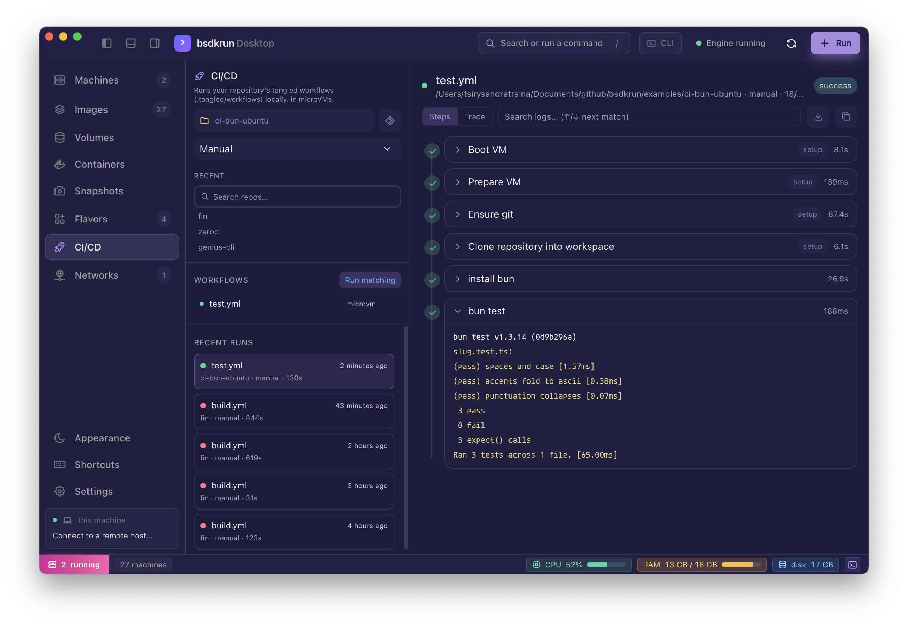
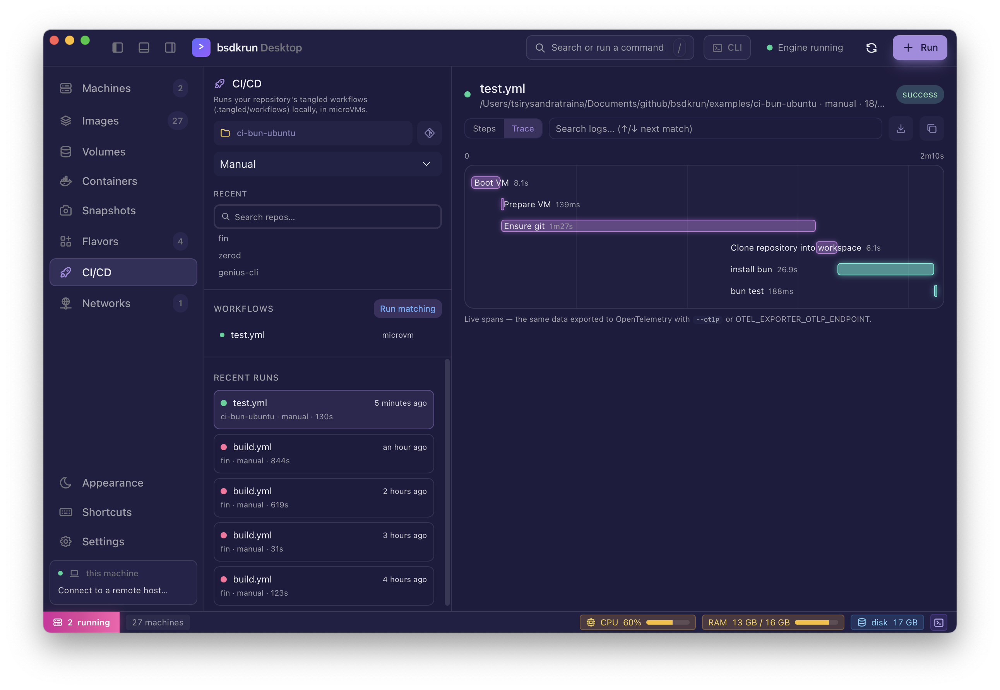

<p align="center">
  
</p>

# bsdkrun ci

[](https://github.com/tsirysndr/bsdkrun/actions/workflows/e2e-ci.yml)

Run [tangled](https://tangled.org) spindle CI workflows in bsdkrun microVMs —
locally, from one command, with nothing installed but bsdkrun itself.

```sh
bsdkrun ci run            # run every workflow that matches (manual trigger)
bsdkrun ci ls             # list workflows and whether they'd match
bsdkrun ci serve          # accept spindle pipeline records over HTTP
```

This directory is the tool itself: a Go binary compiled by `core/build.rs` and
embedded into `bsdkrun` exactly as `pack/` is. **An end user never needs Go** —
`bsdkrun ci` extracts and executes it, and the tool drives VMs through the
bsdkrun CLI itself, pointed back at the very binary that launched it
(`$BSDKRUN_BIN`).

## Why this exists

Spindle runs a repository's `.tangled/workflows/*.yml` when a knot sees a push.
That is the right place for CI to run — and the wrong place to *iterate* on it.
The push-edit-push loop for debugging a workflow is miserable everywhere, and
spindle's microvm engine only runs on Linux hosts with KVM.

`bsdkrun ci` runs the same files, in real microVMs, on the machine in front of
you. A workflow that passes here is a workflow spindle will run the same way,
because the parts that could disagree are not reimplemented:

- **The schema and `when:` matching are tangled's own Go package**
  (`tangled.org/core/workflow`), imported, not transcribed. Glob semantics,
  constraint defaults, pull-request action types — all upstream's code.
- **The environment is spindle's**: `CI=true` and the full `TANGLED_*` set
  (`TANGLED_COMMIT_SHA`, `TANGLED_REF`, `TANGLED_PR_TARGET_BRANCH`, manual
  inputs as `TANGLED_INPUT_*`, …), derived the same way.
- **The layout is spindle's**: steps run serially in one VM from
  `/tangled/workspace`, `HOME=/tangled/home`, system steps (nix config, clone)
  ahead of user steps.
- **The log format is spindle's**: `--json` emits its LogLine records
  (`kind: control|data`, `step_status`, streams), so anything that consumes a
  spindle log stream consumes this.

## What a run does

For each matching workflow:

1. **Image.** The `dependencies:` list becomes a [nixery.dev](https://nixery.dev)
   image — `nixery.dev/[arm64/]<deps…>/bash/git/coreutils/util-linux/nix` — the
   same mapping spindle's nixery engine uses (plus `util-linux`, because a
   microVM mounts `/proc` and its shares itself and needs a `mount(8)` to do it
   with; containers get that from the runtime). Both dependency spellings are
   accepted: the plain list (`engine: microvm`) and the registry map
   (`engine: nixery`). Custom registries (`github:owner/repo/rev`) install via
   `nix profile add` inside the VM. An `image:` that reads as an OCI reference
   (`ubuntu:24.04`, `ghcr.io/org/img`) boots that image directly instead — no
   nixery, no nix; the runner only ensures git is present for the clone. If
   nixery cannot serve the image (its server-side build can outlast the
   gateway timeout on big dependency sets), the run falls back to the pinned
   `nixos/nix` image and installs the dependencies with `nix profile add`.
2. **VM.** bsdkrun boots the image as a microVM (2 CPUs / 2048 MiB by default;
   `--cpus`, `--mem`). The repository is mounted **read-only** at
   `/tangled/source` — a CI step cannot write to the checkout that triggered it.
3. **Clone.** The HEAD commit is fetched from that mount into
   `/tangled/workspace` by SHA, honouring `clone:` options (depth, submodules,
   tags, skip). **The dirty working tree never runs** — CI that quietly tested
   uncommitted changes would pass locally and fail everywhere else. Commit
   first.
4. **Steps**, serially, each from the workspace, with workflow + step
   environment applied. First failure stops the workflow; the VM is destroyed
   unless `--keep`, which leaves it for `bsdkrun shell <id>`.

## Examples

Two runnable copies of the same bun test suite, one per image strategy:

- [`examples/ci-bun-ubuntu`](../examples/ci-bun-ubuntu) — `image: ubuntu:24.04`,
  a plain Ubuntu microVM; the workflow installs bun itself, no nixery involved.
- [`examples/ci-bun-nixery`](../examples/ci-bun-nixery) — `dependencies: [bun]`,
  the toolchain arrives in a nixery image and the workflow is a single step.

Each README shows the copy-out-and-run procedure (CI runs the HEAD commit, so
the example needs its own git repository).

## Triggers

A spindle gets trigger metadata from a knot event; a local run synthesizes the
same shape from the checkout:

| Flag                       | Simulates                                                                    |
| -------------------------- | ---------------------------------------------------------------------------- |
| *(default)* `--event manual` | Manual dispatch of HEAD. Constraints are skipped, as spindle skips them.    |
| `--event push`             | A push of `HEAD~1..HEAD` to the current branch; `paths:` matches those files. |
| `--event pull_request`     | A PR from the current branch onto `--branch` (default branch otherwise).      |

Naming workflows (`bsdkrun ci run test lint`) or passing files (`-f wf.yml`)
selects them directly and skips `when:` matching — naming *is* the selection.

Identity fields a local checkout does not have (knot, DIDs) are filled with
recognizable placeholders (`localhost`, `did:local:…`) rather than left empty.

## Secrets

Spindle injects a repository's vault secrets as environment variables into
every step. A local run has no vault, so the values come from you:

```sh
bsdkrun ci run --secret NPM_TOKEN            # value from the host environment
bsdkrun ci run --secret API_KEY=xyz          # explicit value
bsdkrun ci run --secrets-file .env.ci        # dotenv file (repeatable)
```

`.tangled/secrets.env` in the workflow root is loaded automatically when it
exists — **gitignore it**: the clone step runs the committed tree, and a
committed secrets file would ride into every guest.

Secrets reach every step's environment (they beat the workflow's committed
`environment:`, a step's own env stays most specific), and their values are
masked as `***` in every output — human, `--json`, the TUI, the desktop and
web screens — including their base64 encodings, so `echo "$TOKEN" | base64`
leaks nothing either. Masking follows spindle's own SecretMask semantics.

## OpenTelemetry tracing

Every run is a trace: one root span per workflow, one child span per step
(the boot included), each span carrying the workflow, repository and step
attributes plus the error message when a step fails.

Spans are **always recorded locally**, into the engine's SQLite — no
collector required:

```sh
bsdkrun ci traces               # recent runs: trace id, workflow, status, duration
bsdkrun ci spans <trace-id>     # that run's steps, with per-span timings
```

The daemon exposes the same history over GraphQL (`ciTraces`,
`ciTraceSpans`), which is what the desktop/web CI screen's **Trace** view
renders — a live waterfall that fills in span by span while the run is
still going.

<p align="center">
  
</p>

To export to a real collector (Jaeger, Grafana Tempo, anything OTLP), point
the standard variable — or the flag — at it:

```sh
bsdkrun ci run --otlp http://localhost:4318
OTEL_EXPORTER_OTLP_ENDPOINT=http://localhost:4318 bsdkrun ci run
```

Each span is POSTed to `/v1/traces` (OTLP/HTTP JSON) **the moment it ends**,
so a collector's live view fills in step by step; the root span lands last
and closes the trace. Export is fire-and-forget with a short timeout: a slow
collector never slows the build it is observing, and a dead one never fails
it. The encoder is hand-rolled — one file, no OpenTelemetry SDK dependency —
because a CI runner needs exactly one shape of span.

## `bsdkrun ci serve`

The server half: a runner that accepts spindle's own `sh.tangled.pipeline`
records over HTTP and executes each workflow in a microVM.

```sh
bsdkrun ci serve --bind 0.0.0.0:8517
curl -X POST localhost:8517/pipelines -d @pipeline.json   # → {"id":"run-1"}
curl localhost:8517/pipelines/run-1                       # status + step results
curl localhost:8517/pipelines/run-1/logs                  # spindle LogLine JSON
```

Deliberately the *runner seam*, not the whole spindle: jetstream ingestion,
XRPC, secrets and AT-proto record publishing stay with spindle (or
[tack](https://github.com/mitchellh/tack)). This serves the piece bsdkrun is
uniquely placed to provide — executing a pipeline in real VMs — behind an
interface small enough to point either of them at, or curl by hand. In serve
mode the clone fetches from the knot URL in the record's trigger metadata.

## Workflows from code

Every [bsdkrun SDK](../sdk) can define workflows as code and run them — the YAML is
generated, byte-compatible with what spindle parses, and never has to be
written by hand:

```go
// Go
bsdkrun.Workflow("test").OnPush("main").Deps("go", "gcc").
    Step("test", "go test ./...").Run()
```

```elixir
# Elixir
Bsdkrun.CI.workflow("test")
|> Bsdkrun.CI.on_push("main")
|> Bsdkrun.CI.deps(["elixir", "erlang"])
|> Bsdkrun.CI.step("test", "mix test")
|> Bsdkrun.CI.run()
```

`yaml()` renders the file, `save(repo)` commits it to `.tangled/workflows/` for
spindle to run on push, and `run()` executes it immediately in a microVM
without touching the repository. The same surface exists in TypeScript,
Python, Rust, Ruby, Clojure, Gleam and Scala.

## Environment

| Variable                       | Effect                                                                 |
| ------------------------------ | ---------------------------------------------------------------------- |
| `BSDKRUN_BIN`                  | The bsdkrun binary the SDK drives (set automatically by `bsdkrun ci`). |
| `BSDKRUN_CI_NIXERY`            | A self-hosted nixery instance instead of `nixery.dev`.                 |
| `OTEL_EXPORTER_OTLP_ENDPOINT`  | Export one OpenTelemetry span per step to this collector (see above).  |

## Building

`cargo build` at the repo root compiles this automatically when Go ≥ 1.25 is on
PATH (see `core/build.rs::ensure_ci_binary`); without Go, bsdkrun builds
normally and `bsdkrun ci` explains what is missing. Under nix, the flake's
`ciBin` derivation builds it and `preBuild` drops it into `core/src/ci-bin/`.

The tool drives VMs with its own thin CLI driver (`driver.go`), not the Go
SDK: a module `replace` to `../sdk/go` looked right but froze the SDK inside
nix's fixed-output vendor step, shipping stale code that go.sum could not see
change. The CLI flags it drives are the same public surface every SDK uses.
